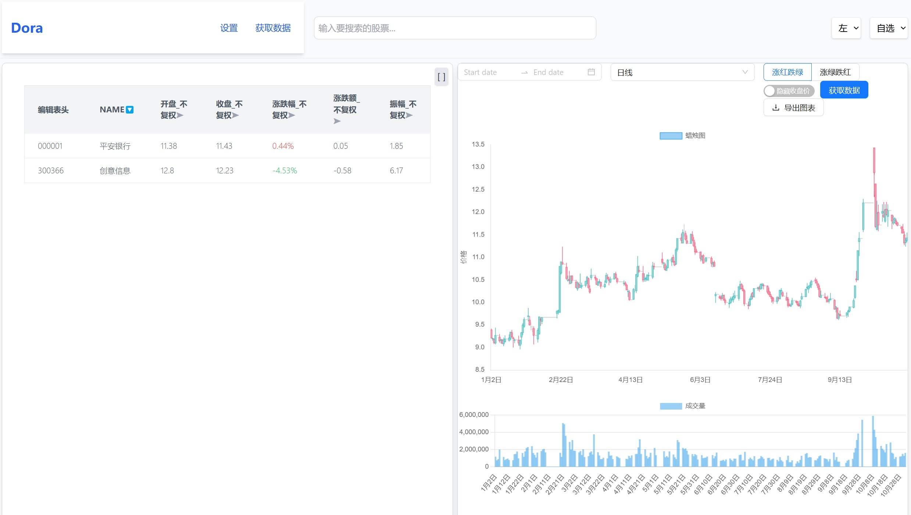
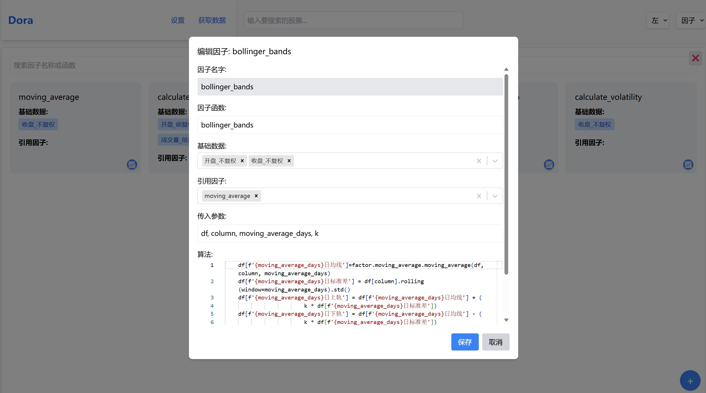
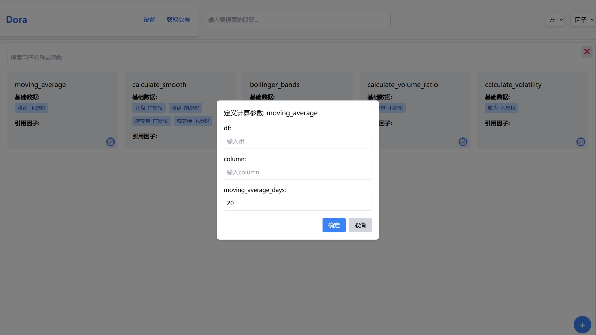
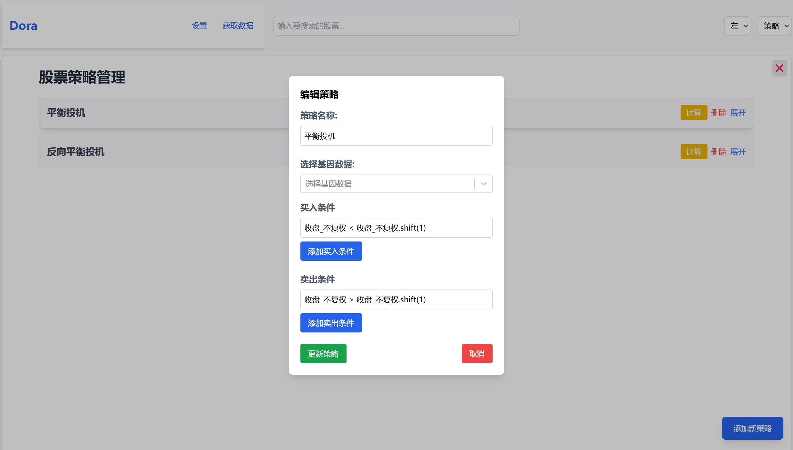
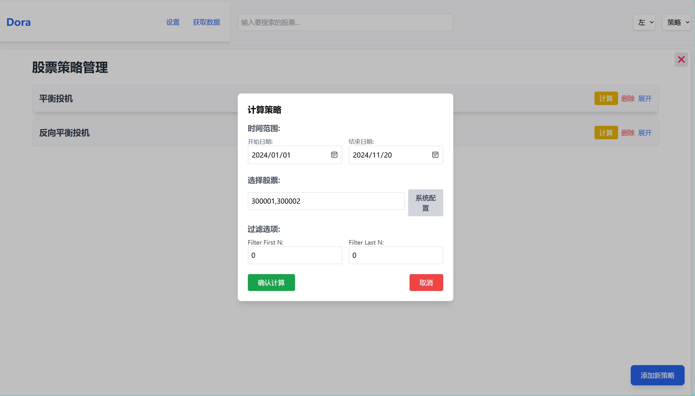
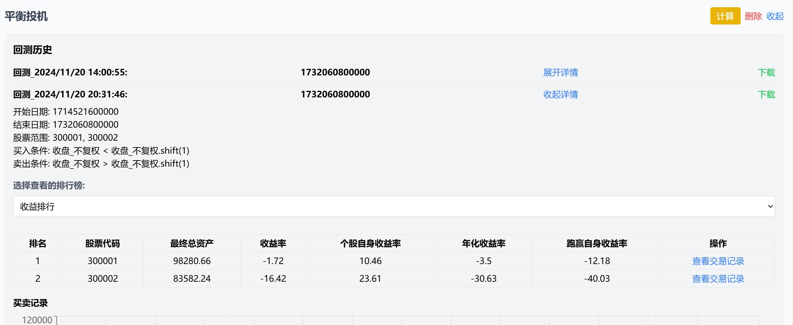
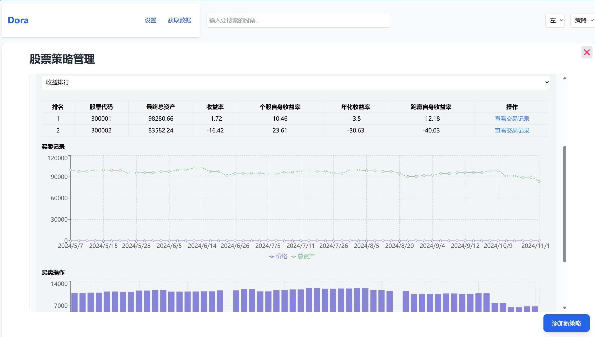

# 可视化的数据获取，处理和批量回测系统 

本地数据获取，支持增量更新和全量更新。
策略和因子自由创建编辑和批量回测 
所有数据完全本地化处理。 

自选股



因子编辑和计算


计算参数自定义，图中是计算20日均线



策略编辑和回测

 


回测历史和可视化
 



环境要求：  
- Python 3.12  
- Node.js 21  
- mysql
---

## 前端  

### 部署步骤  
1. 进入 `redux` 目录：  
   ```bash  
   cd redux  
   ```  
2. 安装依赖：  
   ```bash  
   npm install  
   ```  

### 启动前端  
1. 在 `redux` 目录下运行：  
   ```bash  
   npm run dev  
   ```  

---

## 后端  

### 部署步骤  
1. 初始化数据库（运行时间较长，仅需执行一次）：  
   ```bash  
   cd python/sql  
   python3 adddb.py  
   ```  

### 启动后端  
1. 进入 `python` 目录：  
   ```bash  
   cd python  
   ```  
2. 启动后端服务：  
   ```bash  
   python3 app.py  
   ```  

---
 
- **完全本地化**：所有数据均在本地处理，确保数据安全与隐私。  
- **灵活性强**：支持用户自定义策略与因子编辑。  
- **可视化体验**：直观的界面设计，便于操作与分析。  

---

## 注意事项  
1. 确保 Python 和 Node.js 版本符合要求，否则可能导致运行错误。  
2. 数据库初始化脚本（`adddb.py`）只能运行一次，多次运行会影响系统正常工作。  
3. 如遇启动失败，检查依赖是否正确安装。
4. stocklist初始情况下有300开头的100只股票。因子计算时默认计算stocklist的100只股票，可在主界面编辑stocklist。
### 欢迎反馈  
如有问题或建议，请提交 Issue。
